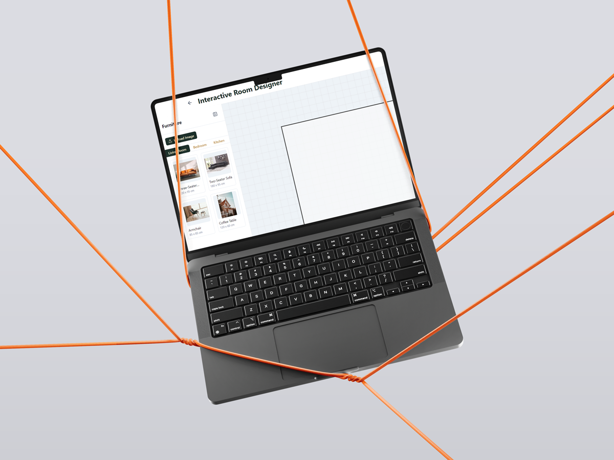

# Interactive Room Designer

A modern web application for designing and visualizing room layouts with an intuitive drag-and-drop interface.


## Features

- **Multiple Room Shapes**: Design rectangular, L-shaped, or custom room layouts
- **Furniture Library**: Extensive collection of furniture items across various categories
- **Drag & Drop Interface**: Easily place and arrange furniture in your design
- **Measurement Tools**: Precise measurements with support for both metric and imperial units
- **Room Templates**: Start with pre-designed room templates or create your own
- **Dark/Light Mode**: Choose your preferred theme for comfortable designing
- **Export Options**: Save your designs as PNG or PDF with customizable settings
- **Responsive Design**: Works on desktop and tablet devices

## Tech Stack

- **Frontend**: React 18 with TypeScript
- **UI Framework**: Chakra UI with custom theme
- **Styling**: TailwindCSS for additional styling flexibility
- **Animation**: Framer Motion for smooth transitions and interactions
- **Build Tool**: Vite for fast development and optimized production builds

## Getting Started

### Prerequisites

- Node.js (v16 or higher)
- npm or yarn

### Installation

```bash
# Clone the repository
git clone https://github.com/samansalari/Interactive-Room-Designer-CAD.git
cd interactive-room-designer

# Install dependencies
npm install
# or
yarn install

# Start the development server
npm run dev
# or
yarn dev
```

The application will be available at `http://localhost:5173`

## Usage

1. **Welcome Screen**: Start by selecting to create a new room or choose from templates
2. **Room Setup**: Define your room dimensions, shape, and basic properties
3. **Designer**: Use the sidebar to browse and add furniture, then drag items into position
4. **Export**: Save your design as an image or PDF for sharing or printing

## Project Structure

```
src/
├── components/     # UI components
├── context/        # React context providers
├── types/          # TypeScript type definitions
├── utils/          # Utility functions
├── App.tsx         # Main application component
├── main.tsx        # Application entry point
└── theme.ts        # Custom theme configuration
```

## Building for Production

```bash
npm run build
# or
yarn build
```

The built files will be in the `dist` directory, ready for deployment.

## License

[MIT License](LICENSE)

## Author

Created by Saman (https://samansalari.com)
